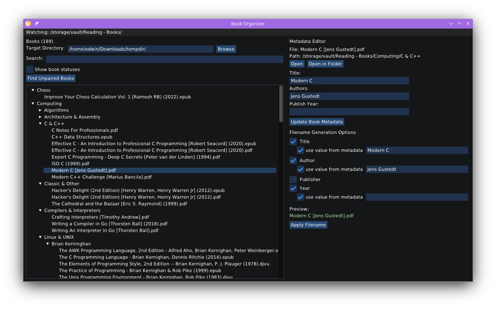

# Book Organizer

An ImGUI C++ application for managing and syncing eBooks and PDFs.

It's mostly vibe-coded, but it Should Work.



## Setup

```bash
git clone git@github.com:hyperupcall-experiments/book-organizer
cd ./book-organizer
conan install --build=missing .
cmake --preset conan-release
cmake --build ./build --preset conan-release
cmake --install ./build/Release --prefix ~/.local --strip
./build/BookOrganizer
```
